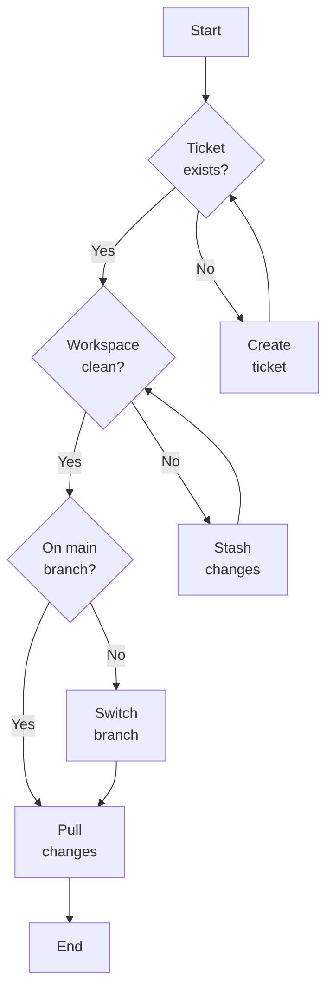

# Before you start

---
hideInToc: true
layout: two-cols
---

# Ask these questions.

1. Do you have a ticket? <br />
    If not, create a ticket.
2. Is the workspace clean?
    ```shell
    git status
    ```
    If not, stash changes including untracked files.
    ```shell
    git stash -u
    ```
3. Are you on the `main` branch?
    ```shell
    git switch main
    ```
4. Do you have the latest upstream changes?
    ```shell
    git pull
    ```

::right::

<div class="absolute left-150px">



</div>
