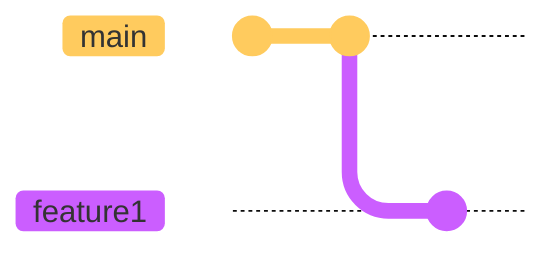
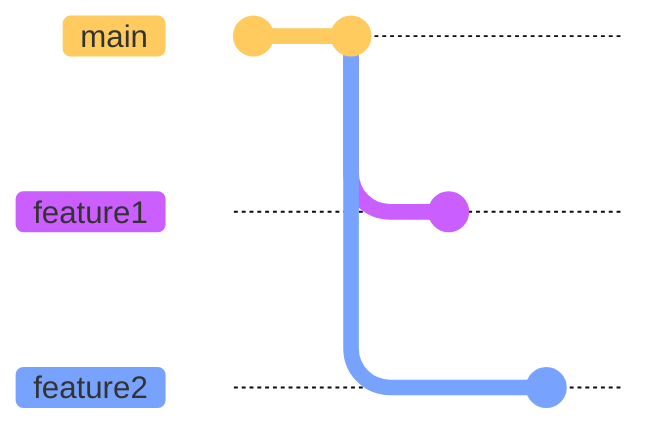
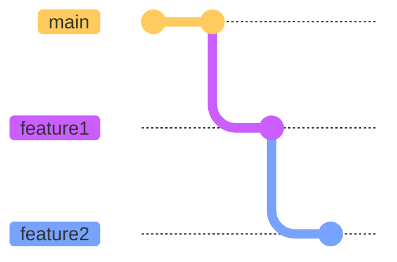
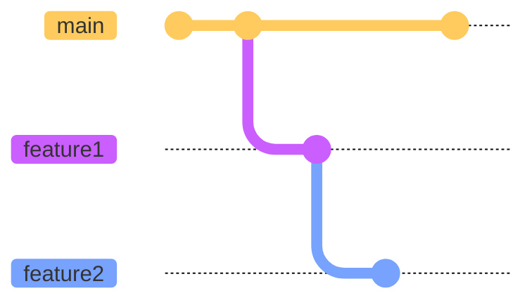
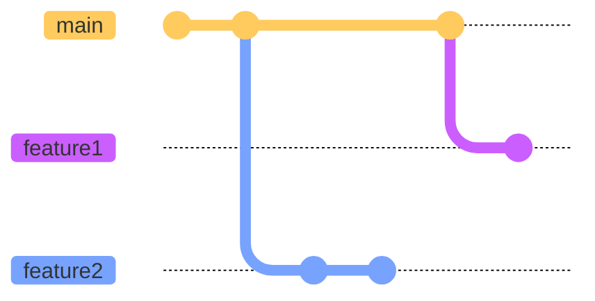
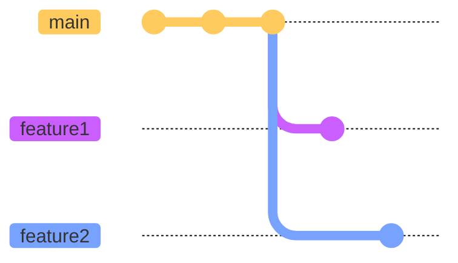

# Do the change

---
layout: two-cols
---

Create a feature branch for each change.

```shell
git switch -c feature1
```

<v-click>

Make the change that will be the commit.


</v-click>

<v-click>

Add and commit this change.

```shell
git add -p
git commit
```

</v-click>

::right::



---
layout: full
preload: false
---

<video autoplay controls onloadstart="this.playbackRate = 0.67;">
  <source src="/videos/do-the-change-feature1.webm" type="video/webm">
</video>

---
layout: two-cols
---

> What if I have another change?

<v-click>

Create another feature branch from the `main` branch.

```shell
git switch main
git switch -c feature2
git add -p
git commit
```

</v-click>

::right::

<div v-after>



</div>

---
layout: full
preload: false
---

<video autoplay controls onloadstart="this.playbackRate = 0.67;">
  <source src="/videos/do-the-change-feature2.webm" type="video/webm">
</video>

---
layout: two-cols
---

> What if I have another change that requires the previous change?

<v-click>

Create another feature branch from the `feature1` branch.

```shell
git switch feature1
git switch -c feature2
git add -p
git commit
```

</v-click>

::right::

<div v-after>



</div>

---
layout: full
preload: false
---

<video autoplay controls onloadstart="this.playbackRate = 0.67;">
  <source src="/videos/do-the-change-feature1-feature2.webm" type="video/webm">
</video>

---
layout: two-cols
---

> What should I do if there are new commits on the `main` branch?

<v-click>

Pull the new changes.

```shell
git switch main
git pull
```

</v-click>

::right::



---
layout: two-cols
---

> What should I do if there are new commits on the `main` branch?

Rebase `feature1` to `main`.

```shell
git switch feature1
git rebase main
```

::right::



---
layout: two-cols
hideInToc: true
---

> What should I do if there are new commits on the `main` branch?

Rebase `feature2` to `main`.

```shell
git switch feature2
git rebase -i main
```

<v-click>

Editor will load.

```git-rebase {all|1,14}
pick 1 feature1
pick 2 feature2

# Rebase 0..2 onto 0 (2 commands)
#
# Commands:
# p, pick <commit> = use commit
# r, reword <commit> = use commit, but edit the commit message
# s, squash <commit> = use commit, but meld into previous commit
# f, fixup [-C | -c] <commit> = like "squash" but keep only the previous
#                    commit's log message, unless -C is used, in which case
#                    keep only this commit's message; -c is same as -C but
#                    opens the editor
# d, drop <commit> = remove commit
```

<Arrow x1="175" y1="213" x2="125" y2="213" color="red"/>
<Arrow x1="28" y1="510" x2="28" y2="460" color="red"/>

</v-click>

::right::



---
layout: full
preload: false
---

<video autoplay controls onloadstart="this.playbackRate = 0.67;">
  <source src="/videos/do-the-change-new-commits.webm" type="video/webm">
</video>
