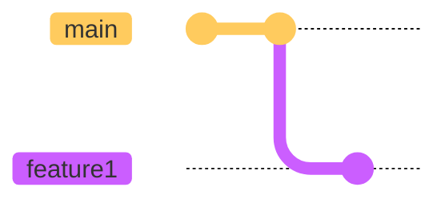
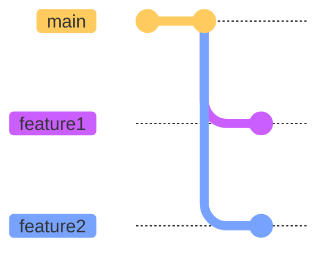
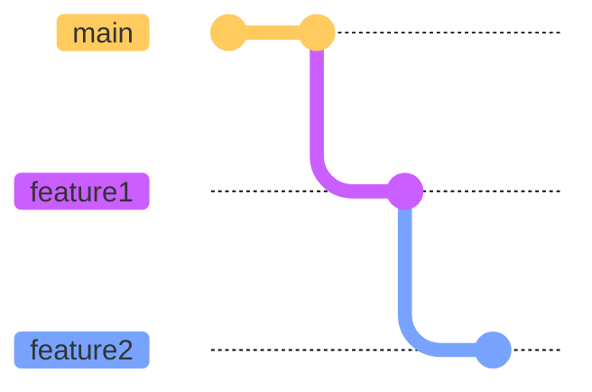
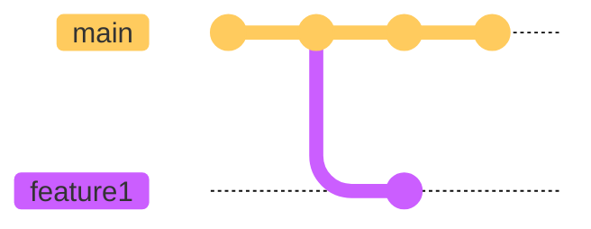
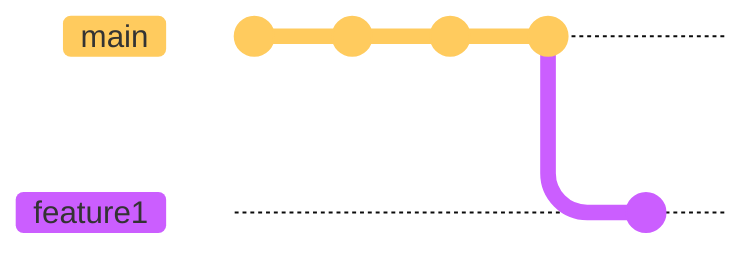

# Do the change

---
layout: two-cols
---

Create a feature branch for each change.

```shell
git switch -c feature1
```

<v-click>

Make the change that will be the commit.


</v-click>

<v-click>

Add and commit this change.

```shell
git add -p
git commit
```

</v-click>

::right::



---
layout: full
preload: false
---

<video autoplay controls onloadstart="this.playbackRate = 0.67;">
  <source src="/videos/do-the-change-feature1.webm" type="video/webm">
</video>

---
layout: two-cols
---

> What if I have another change?

<v-click>

Create another feature branch from the `main` branch.

```shell
git switch main
git switch -c feature2
git add -p
git commit
```

</v-click>

::right::

<div v-after>



</div>

---
layout: full
preload: false
---

<video autoplay controls onloadstart="this.playbackRate = 0.67;">
  <source src="/videos/do-the-change-feature2.webm" type="video/webm">
</video>

---
layout: two-cols
---

> What if I have another change that requires the previous change?

<v-click>

Create another feature branch from the `feature1` branch.

```shell
git switch feature1
git switch -c feature2
git add -p
git commit
```

</v-click>

::right::

<div v-after>



</div>

---
layout: full
preload: false
---

<video autoplay controls onloadstart="this.playbackRate = 0.67;">
  <source src="/videos/do-the-change-feature1-feature2.webm" type="video/webm">
</video>

---
layout: two-cols
---

> What should I do if there are new commits on the `main` branch?

<v-click>

Pull the new changes.

```shell
git switch main
git pull
```

</v-click>

<v-click>

Rebase `feature1` to `main`.

```shell
git switch feature1
git rebase main
```

</v-click>

::right::

<div v-click="[0, 1]" class="absolute">


</div>

<div v-click="[1, 2]" class="absolute">



</div>

<div v-click="2" class="absolute">



</div>

---
layout: full
preload: false
---

<video autoplay controls onloadstart="this.playbackRate = 0.67;">
  <source src="/videos/do-the-change-new-commits.webm" type="video/webm">
</video>
